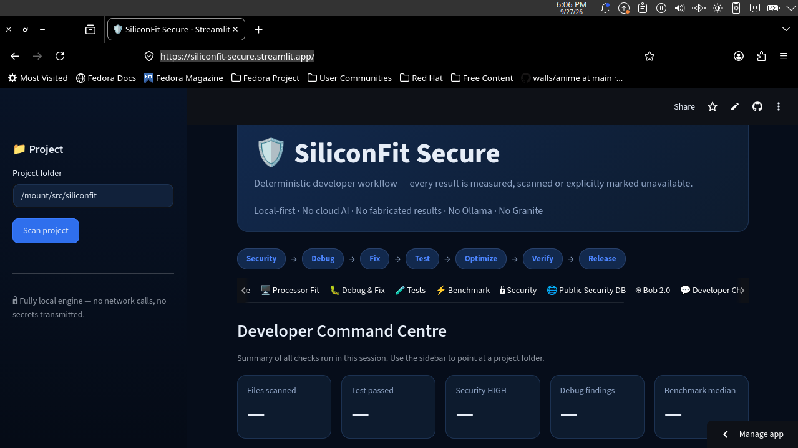
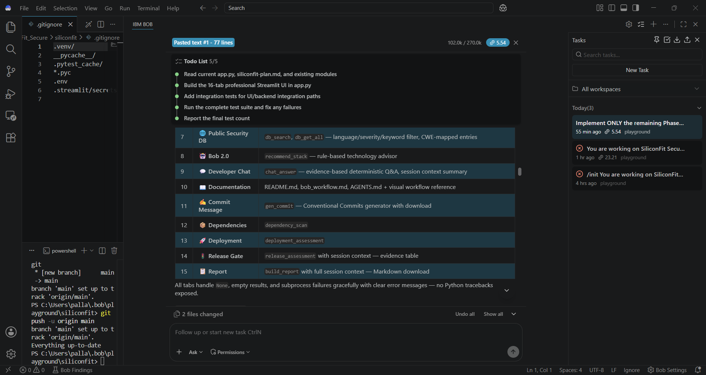
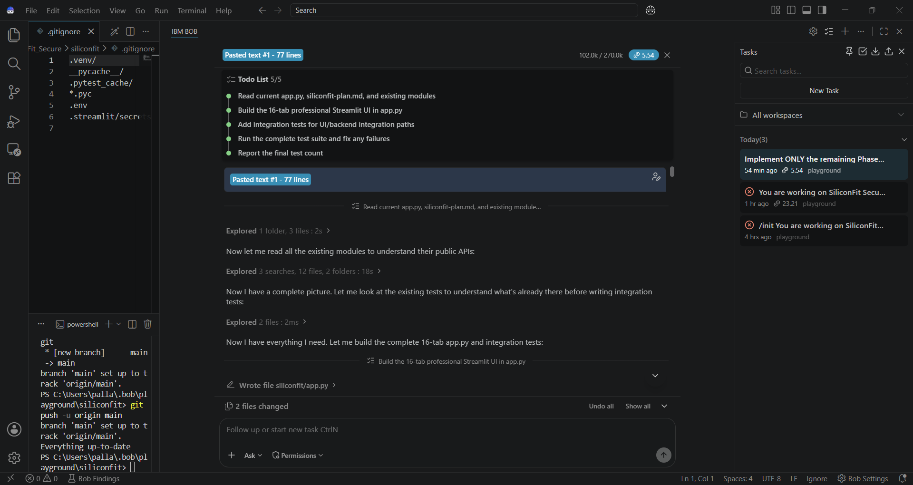
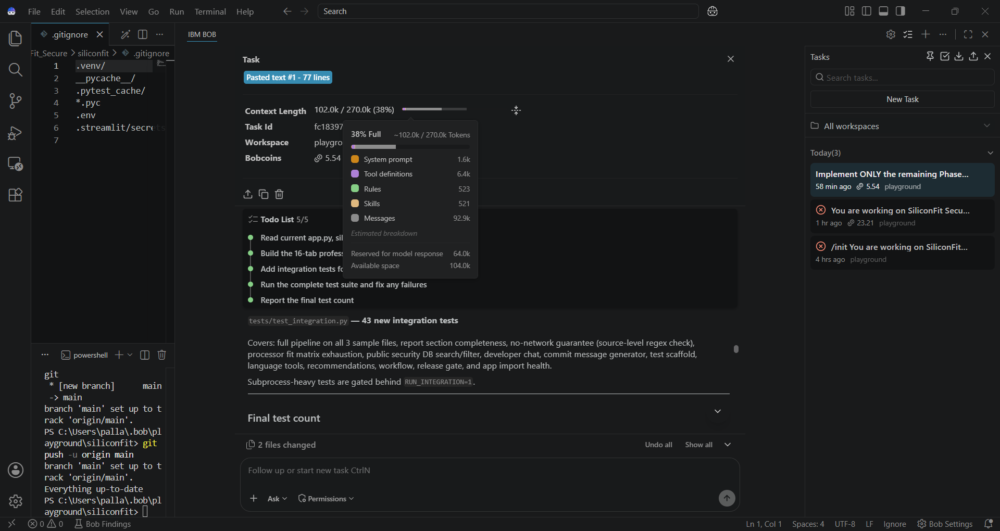
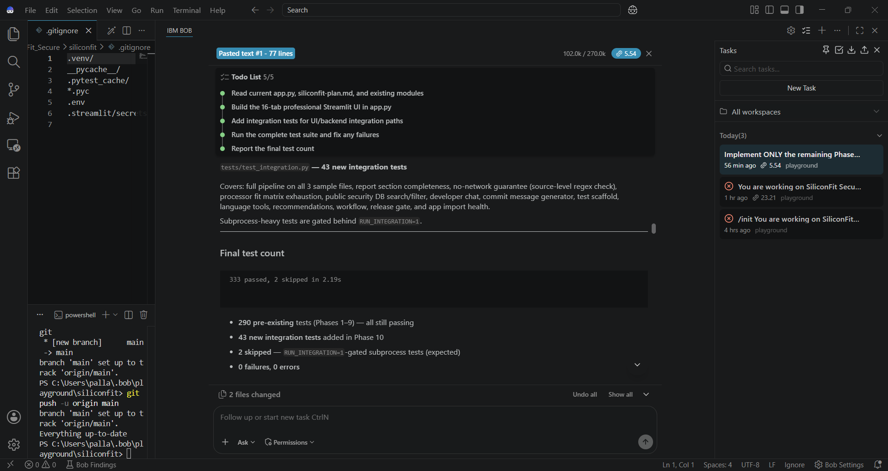
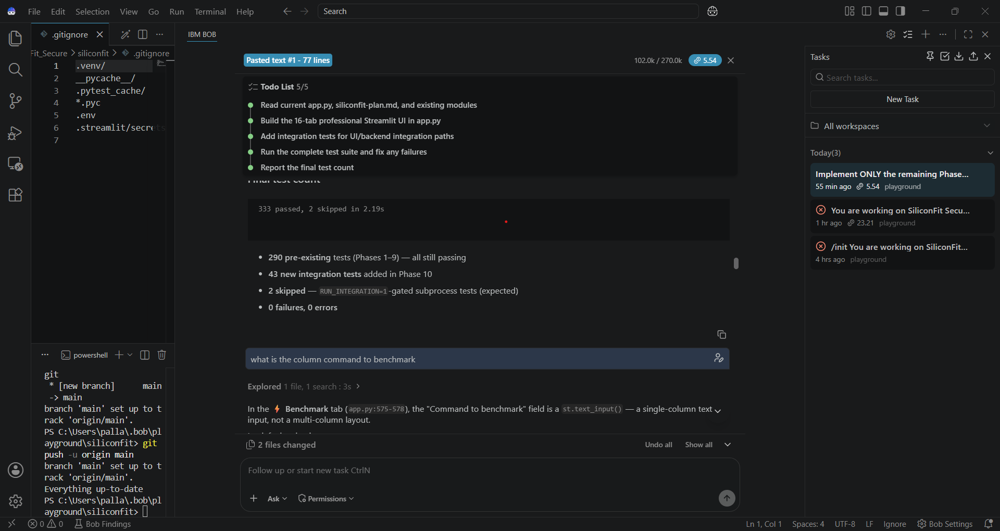
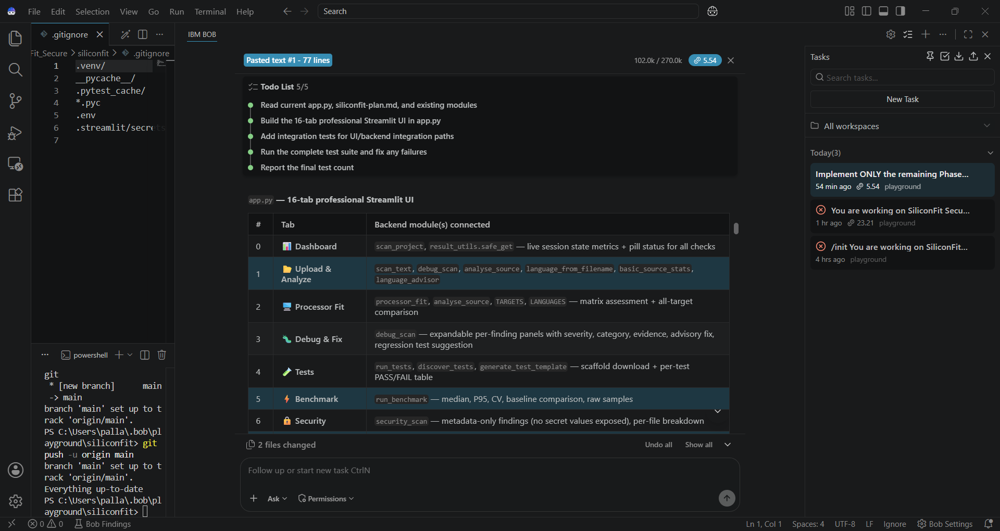

# SiliconFit Secure

**Security — Debug — Fix — Test — Optimize — Verify — Release**

SiliconFit Secure is a deterministic developer workflow platform that transforms software development challenges into structured, evidence-based engineering analysis.

It integrates security scanning, debugging analysis, processor-fit assessment, testing, benchmarking, deployment validation, and release-readiness evaluation into a unified workflow.

---

## Problem Statement

Modern software development often requires developers to use multiple disconnected tools for:

- Security analysis
- Debugging
- Testing
- Performance benchmarking
- Hardware or processor compatibility assessment
- Dependency validation
- Deployment readiness

This fragmented workflow can result in:

- Increased development and debugging time
- Inconsistent analysis across different tools
- Security issues being discovered late in the development lifecycle
- Difficulty determining whether code is suitable for a specific processor or target platform
- Limited visibility into the relationship between code changes and performance
- Manual effort in validating tests, dependencies, and deployment readiness
- Unclear evidence for determining whether a project is ready for release

---

## Project Purpose

SiliconFit Secure addresses this problem by bringing these engineering checks into a single evidence-driven workflow.

Instead of providing only AI-generated suggestions, the platform combines deterministic analysis, measurable results, structured heuristics, and workflow orchestration to help developers move systematically from an identified problem to a release decision.

### Workflow

```text
Problem
   ↓
Analyze
   ↓
Security
   ↓
Debug
   ↓
Fix
   ↓
Test
   ↓
Optimize
   ↓
Benchmark
   ↓
Verify
   ↓
Release Gate
```

The platform assists developers rather than replacing engineering judgment.

Each result is presented as evidence that can be reviewed before making a technical decision.

---

## Architecture

| Component | Role |
|---|---|
| **IBM Bob 2.0** | Orchestrator — guides and coordinates the workflow |
| **SiliconFit** | Evidence Engine — performs deterministic analysis |
| **Developer** | Final Decision Maker — reviews evidence and approves actions |

---

## Features

| Module | Description |
|---|---|
| Dashboard | Project status and consolidated analysis summaries |
| Upload & Analyze | Multi-file upload, language detection, security scanning, and debugging analysis |
| Processor Fit | Language-to-target compatibility analysis with source-level heuristics |
| Debug & Fix | Static analysis of potential bugs and reliability issues |
| Tests | Test discovery, execution, and PASS/FAIL/ERROR/SKIPPED result parsing |
| Benchmark | Wall-clock timing, coefficient of variation, outlier detection, and baseline comparison |
| Defensive Security | Multi-language static security analysis |
| Public Security DB | Curated local CWE reference database |
| Bob 2.0 Workflow | Evidence-driven development workflow with live step status |
| Developer Chat | Rule-based assistance based on available project evidence |
| Documentation | Integrated README and AGENTS.md documentation |
| Commit Message | Conventional Commits message generation |
| Dependencies | Dependency manifest and health assessment |
| Deployment | Deployment-readiness checklist |
| Release Gate | Evidence-based evaluation of security, testing, debugging, and benchmarking |
| Engineering Report | Downloadable Markdown engineering report |

---

## Supported Languages

- C
- C++
- Python
- Rust
- Go
- Java
- JavaScript
- TypeScript
- Custom

---

## Processor Targets

- Generic x86-64
- Intel x86-64
- AMD x86-64
- ARM64
- RISC-V 64
- ESP32-class microcontrollers

---

## Accessing the Application

### Online Access

The deployed version of SiliconFit Secure can be accessed directly through the application:

[**Open SiliconFit Secure**](https://siliconfit-secure.streamlit.app/)

No local installation is required to access the deployed application.

---

## Local Access

SiliconFit Secure can also be run locally from the project source code.

### Prerequisites

- Python 3.10 or later
- Git
- Windows, Linux, or macOS

### 1. Clone the Repository

```bash
git clone <repository-url>
cd SiliconFit-Secure
```

### 2. Create a Virtual Environment

#### Windows

```bash
py -m venv .venv
.venv\Scripts\activate
```

#### Linux/macOS

```bash
python3 -m venv .venv
source .venv/bin/activate
```

### 3. Install Dependencies

```bash
python -m pip install -r requirements.txt
```

### 4. Start SiliconFit Secure

```bash
streamlit run app.py
```

Once Streamlit starts, open the local address displayed in the terminal.

By default:

```text
http://localhost:8501
```

### 5. Run the Test Suite

```bash
python -m pytest -v
```

For environments without internet access:

```bash
python -c "import sys; sys.path.insert(0,'siliconfit'); sys.path.insert(0,'siliconfit/tests'); import pytest; pytest.main(['-v','siliconfit/tests'])"
```

---

## Engineering Principles

SiliconFit Secure follows several principles to maintain reliable and transparent analysis:

- Test results, benchmark measurements, security findings, and processor specifications are never fabricated.
- Advisory outputs are explicitly labelled `advisory: True`.
- Detected secret values are never displayed.
- Security findings are presented as analysis rather than guarantees of security.
- A `PASS` status does not imply that the software is completely secure.
- `READY FOR REVIEW` does not imply production readiness.
- Final engineering decisions remain with the developer.

---

## IBM Bob 2.0 Integration

IBM Bob 2.0 serves as the workflow orchestrator, guiding the development process and coordinating the analysis stages.

SiliconFit provides the deterministic engineering evidence used throughout the workflow, while the developer reviews the evidence and makes the final decision.

Detailed IBM Bob 2.0 usage and workflow information is documented in:

- `AGENTS.md`
- `bob_workflow.md`

---

### Prototype Dashboard


## Screenshots Of Use of BoB 2.0







---

## Project Philosophy

SiliconFit Secure is designed around a simple principle:

> **AI can assist engineering decisions, but evidence should support them.**

The platform combines deterministic tools, measurable results, structured analysis, and AI-assisted workflow orchestration to create a more transparent development process.

---

## Future Development

The current prototype uses predefined hardware profiles.

Future development will focus on making the platform more adaptive and hardware-aware by enabling:

- Automatic hardware detection
- Hardware configuration analysis
- Code-to-hardware compatibility analysis
- Integration with local AI models
- Seamless IBM Bob 2.0 integration
- Hardware-specific code optimization
- Memory and resource optimization
- Automated low-level language recommendations
- Expanded processor and microcontroller support
- Deeper embedded-system analysis

The long-term goal is to evolve SiliconFit Secure from a profile-based prototype into an intelligent, hardware-aware developer platform capable of analysing both software and its target hardware environment.

---

## License

This project is intended for development, research, and demonstration purposes.
